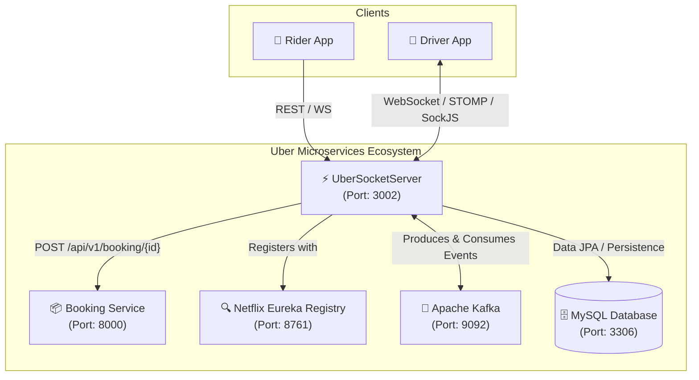

# 🚗 UberSocketServer

[](https://openjdk.org/)
[](https://spring.io/projects/spring-boot)
[](https://spring.io/projects/spring-cloud)
[](https://kafka.apache.org/)
[](https://cloud.spring.io/spring-cloud-netflix/)
[](LICENSE)

**UberSocketServer** is the real-time communication and event dispatching microservice for the Uber backend ecosystem. It manages bi-directional, low-latency WebSocket connections with drivers and riders, handles ride request broadcasting, processes driver acceptances concurrently, and integrates seamlessly with Kafka event streams and Eureka service discovery.

---

## 📑 Table of Contents

- [Architecture Overview](#-architecture-overview)
- [Key Features](#-key-features)
- [Tech Stack](#-tech-stack)
- [WebSocket & STOMP Protocol Guide](#-websocket--stomp-protocol-guide)
  - [Broker Configuration](#broker-configuration)
  - [WebSocket Endpoints & Message Mappings](#websocket-endpoints--message-mappings)
- [REST API Endpoints](#-rest-api-endpoints)
- [Kafka Event Streaming](#-kafka-event-streaming)
- [Configuration & Environment Variables](#-configuration--environment-variables)
- [Getting Started](#-getting-started)
  - [Prerequisites](#prerequisites)
  - [Building and Running](#building-and-running)
- [Project Structure](#-project-structure)

---

## 🏛 Architecture Overview



---

## ✨ Key Features

1. **Real-time Ride Dispatching**:
   - Broadcasts incoming ride requests to eligible drivers via WebSocket topics.
2. **Race-Condition-Safe Ride Matching**:
   - Synchronized driver acceptance handling (`rideResponseHandler`) to ensure ride bookings are assigned to exactly one driver without concurrency conflicts.
   - Direct callback and fallback notification (`ACCEPTED` vs `ALREADY_TAKEN`).
3. **Room & Private Chat Support**:
   - Pub/sub messaging for room chats (`/topic/message/{room}`) and direct driver-passenger messaging (`/user/{userId}/queue/privateMessage/{room}`).
4. **Asynchronous Kafka Event Streaming**:
   - Produces lifecycle events (e.g. driver assignment notifications) to Kafka topics for downstream microservice consumption.
5. **Microservice Discovery & Inter-Service Communication**:
   - Registers with Netflix Eureka for service registry and discovery.
   - Communicates with the Booking Service via `RestTemplate`.

---

## 🛠 Tech Stack

| Technology | Version / Purpose |
|---|---|
| **Java** | 21 (LTS) |
| **Spring Boot** | 4.0.1 |
| **Spring Cloud** | 2025.1.0 (Eureka Client) |
| **Spring WebSocket / STOMP** | SockJS & STOMP Message Broker |
| **Spring Kafka** | Event Streaming / Messaging |
| **Spring Data JPA & Flyway** | Database ORM & Migrations |
| **MySQL** | Database Engine |
| **Lombok** | Boilerplate Reduction |
| **Gradle** | Build Tool |

---

## 🔌 WebSocket & STOMP Protocol Guide

### Broker Configuration

- **Connection Endpoint**: `http://localhost:3002/ws` (SockJS enabled)
- **Application Destination Prefix**: `/app` (Client-to-Server)
- **Broker Destinations**: `/topic` (Public/Broadcast), `/queue` (Private/User-Specific)

### WebSocket Endpoints & Message Mappings

| Action | Destination Prefix | Target Endpoint | Description | Return / Broadcast Destination |
|---|---|---|---|---|
| **Ping Check** | `/app` | `/ping` | Connectivity health check | `/topic/ping` |
| **Room Chat** | `/app` | `/chat/{room}` | Send message to a specific room | `/topic/message/{room}` |
| **Private Chat** | `/app` | `/privateChat/{room}/{userId}` | Send private message to target user | `/user/{userId}/queue/privateMessage/{room}` |
| **Driver Ride Response** | `/app` | `/rideResponse/{userId}` | Driver accepts/declines a ride | `/topic/rideResponse/{userId}` (`ACCEPTED` / `ALREADY_TAKEN`) |

---

## 📡 REST API Endpoints

### 1. Health / Kafka Smoke Test
- **Method**: `GET`
- **URL**: `/api/socket`
- **Description**: Publishes a test message to Kafka `sample-topic` and returns `true`.

### 2. Dispatch New Ride Request
- **Method**: `POST`
- **URL**: `/api/socket/newride`
- **Headers**: `Content-Type: application/json`
- **Request Body**:
```json
{
  "passengerId": 101,
  "bookingId": 5001,
  "driverIds": [201, 202, 203]
}
```
- **Response**: `200 OK` (`true`)
- **Side Effect**: Broadcasts `RideRequestDto` to WebSocket destination `/topic/rideRequest`.

---

## 📨 Kafka Event Streaming

- **Topic Name**: `sample-topic` (Auto-configured with 1 partition, replication factor 1)
- **Producer Service** ([`KafkaProducerService.java`](file:///src/main/java/com/example/ubersocketserver/Producers/KafkaProducerService.java)):
  - Publishes notifications (e.g., `"Ride assigned to Driver <userId>"`).
- **Consumer Service** ([`KafkaConsumerService.java`](file:///src/main/java/com/example/ubersocketserver/Consumers/KafkaConsumerService.java)):
  - Group ID: `sample-group`
  - Listens and logs messages received on `sample-topic`.

---

## ⚙️ Configuration & Environment Variables

Default settings in [`application.properties`](file:///src/main/resources/application.properties):

```properties
spring.application.name=UberSocketServer
server.port=3002

# Eureka Service Discovery
eureka.client.service-url.defaultZone=http://localhost:8761/eureka
eureka.instance.preferIpAddress=true

# Database Configuration
spring.datasource.url=jdbc:mysql://localhost:3306/Uber_Db_local
spring.datasource.username=root
spring.datasource.password=Mukul@142005
spring.jpa.hibernate.ddl-auto=validate
spring.flyway.enabled=true
spring.flyway.baseline-on-migrate=true

# Kafka Configuration
spring.kafka.bootstrap-servers=localhost:9092
spring.kafka.consumer.group-id=sample-group
spring.kafka.consumer.auto-offset-reset=earliest
```

---

## 🚀 Getting Started

### Prerequisites

- **JDK 21** installed and configured (`JAVA_HOME`).
- **MySQL Server** running on port `3306` with database `Uber_Db_local`.
- **Apache Kafka & Zookeeper / KRaft** running on `localhost:9092`.
- **Eureka Server** running on `http://localhost:8761/eureka`.
- **Booking Service** running on `http://localhost:8000`.

### Building and Running

1. **Clone the repository**:
   ```bash
   git clone https://github.com/MukulVerma14/UberProject-SocketServer.git
   cd UberSocketServer
   ```

2. **Build the project with Gradle**:
   ```bash
   # On Linux/macOS
   ./gradlew clean build

   # On Windows
   .\gradlew.bat clean build
   ```

3. **Run the Application**:
   ```bash
   # On Linux/macOS
   ./gradlew bootRun

   # On Windows
   .\gradlew.bat bootRun
   ```

4. **Verify Application Status**:
   - Access endpoint: `http://localhost:3002/api/socket`
   - WebSocket URL: `ws://localhost:3002/ws`

---

## 📂 Project Structure

```text
UberSocketServer/
├── src/
│   ├── main/
│   │   ├── java/com/example/ubersocketserver/
│   │   │   ├── UberSocketServerApplication.java   # Spring Boot Main Entry Point
│   │   │   ├── configuration/
│   │   │   │   ├── KafkaConfig.java              # Kafka Producer & Consumer Beans
│   │   │   │   ├── ScheduleConfig.java           # Spring Task Scheduling Config
│   │   │   │   └── WebSocketConfig.java          # STOMP & SockJS Configuration
│   │   │   ├── controller/
│   │   │   │   ├── DriverRequestController.java  # Ride Dispatch & Driver Matching Controller
│   │   │   │   └── TestController.java           # Chat & Ping WebSocket Handlers
│   │   │   ├── dto/                              # Request/Response Data Transfer Objects
│   │   │   │   ├── ChatRequest.java
│   │   │   │   ├── ChatResponse.java
│   │   │   │   ├── RideRequestDto.java
│   │   │   │   ├── RideResponseDto.java
│   │   │   │   ├── TestRequest.java
│   │   │   │   ├── TestResponse.java
│   │   │   │   ├── UpdateBookingRequestDto.java
│   │   │   │   └── UpdateBookingResponseDto.java
│   │   │   ├── models/
│   │   │   │   └── ExactLocation.java
│   │   │   ├── Producers/
│   │   │   │   └── KafkaProducerService.java     # Kafka Producer Service
│   │   │   └── Consumers/
│   │   │       └── KafkaConsumerService.java     # Kafka Consumer Listener
│   │   └── resources/
│   │       └── application.properties            # Application Configuration
│   └── test/
│       └── java/com/example/ubersocketserver/
│           └── UberSocketServerApplicationTests.java
├── build.gradle                                  # Gradle Build Configuration
├── settings.gradle
└── README.md
```
